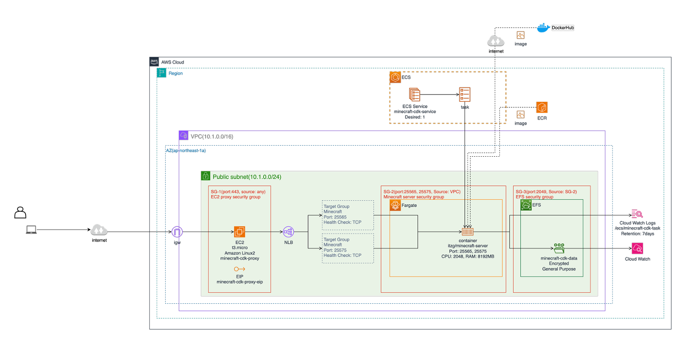

# Minecraft MCP Server

AWS ECS上でMinecraftサーバーを実行し、MCP（Model Context Protocol）を通じてリモートから管理できるツールです。

## 1. 概要

- **AWS ECS上でのMinecraftサーバー実行**: スケーラブルなクラウド環境でMinecraftサーバーを運用
- **MCP統合**: Claude Desktopやその他のMCPクライアントから直接Minecraftサーバーを管理
- **RCONサポート**: リモートコンソール経由でサーバーコマンドを実行
- **自動リソース検出**: AWSリソースを自動的に検出・設定
- **AWS CDK対応**: インフラストラクチャをコードとして管理

### 1-1. デモンストレーション

Claude DesktopからMinecraftサーバーを直接操作する様子：


*MCP経由でのMinecraftサーバー操作のデモンストレーション*

### 1-2. システム全体アーキテクチャ


*システム全体のアーキテクチャ*

## 2. 前提条件

### 2-1. 必須ツール

- **Python 3.12.8** - CDKとMCPサーバー用
- **Node.js 22.19.0** - CDK用
- **AWS CLI 2.30.7** - AWS認証・操作用
- **jq 1.8.1** - JSON処理用

### 2-2. オプションツール

- **Terraform 1.6.0** - オプション（WIP、CDK版を推奨）

**注意**: このプロジェクトでは`.tool-versions`ファイルでツールバージョンを管理しています。お好みのツール管理方法（asdf、pyenv、nvm、brew等）をご利用ください。


### 2-3. 必要な権限

このツールを使用するには、以下のAWSサービスに対する権限が必要です：

- **ECS**: タスクの作成・管理
- **EC2**: インスタンスの作成・管理
- **VPC**: ネットワークリソースの作成・管理
- **IAM**: ロールとポリシーの作成・管理
- **CloudWatch**: ログとメトリクスの管理
- **Application Load Balancer**: ロードバランサーの作成・管理
- **EFS**: ファイルシステムの作成・管理

開発時は管理者権限（`AdministratorAccess`）を使用できますが、本番環境では上記サービスに対して必要最小限の権限を持つIAMユーザーまたはロールを適切に設定してください。

## 3. セットアップ

### 3-1. リポジトリのクローン

```bash
git clone <repository-url>
cd minecraft-mcp-aws-ecs-fargate
```

### 3-2. 環境設定

```bash
# 環境変数ファイルをコピー
cp env.example .env

# .envファイルを編集して実際の値を設定
nano .env

# 環境変数を読み込み
set -a
source .env
set +a
```

**環境変数読み込みについての補足:**
- `set -a`: 以降に設定される変数を自動的にエクスポート
- `source .env`: `.env`ファイルの内容を現在のシェルに読み込み
- `set +a`: 自動エクスポートを無効化

#### Dockerイメージの設定

このプロジェクトでは、MinecraftサーバーのDockerイメージを以下の方法で設定できます。DockerHubのレート制限による問題を回避するため、プライベートなECRリポジトリを使用できます：

**デフォルト（DockerHub）:**
```bash
# .envファイルでDOCKER_IMAGEを空にするか、コメントアウト
DOCKER_IMAGE=
```

**ECR（プライベートリポジトリ）:**
```bash
# .envファイルでECRイメージを指定
DOCKER_IMAGE=123456789012.dkr.ecr.ap-northeast-1.amazonaws.com/my-minecraft-server:latest
```
**注意事項:**
- ECRイメージを使用する場合、ECSタスク実行ロールにECRプル権限が自動的に追加されます
- **x86_64アーキテクチャ（Intel）**: デフォルトでサポート、追加設定不要
- **ARM64アーキテクチャ**: ECS Fargateでサポートされていますが、タスク定義に追加オプションが必要です ([AWSドキュメント](https://docs.aws.amazon.com/AmazonECS/latest/developerguide/ecs-arm64.html))

### 3-3. MCPサーバーの設定

```bash
# rcon-toolの依存関係をインストール
cd rcon-tool
python -m venv .venv
source .venv/bin/activate  # Windows: .venv\Scripts\activate
pip install -e .
cd ..
```

**注意**: MCPサーバーの詳細な設定手順は[4-4. MCP連携](#4-4-mcp連携ex-claude-desktop)セクションを参照してください。
### 3-4. AWS認証の設定

```bash
# AWS SSOログイン
aws sso login

# 実行例: 
# $aws sso login
# Attempting to automatically open the SSO authorization page in your default browser.
# If the browser does not open or you wish to use a different device to authorize this request, open the following URL:
# https://d-xxxxxxxxxx.awsapps.com/start/#/device
# Then enter the code:
# SWSC-ZQQX
# Successfully logged into Start URL: https://d-xxxxxxxxxx.awsapps.com/start/

# 認証情報の確認
# 現在の認証情報でAWSアカウント情報を確認するには、以下のコマンドを実行します。
aws sts get-caller-identity

# 実行例:
# {
#     "UserId": "AROAEXAMPLEID:yourname",
#     "Account": "123456789012",
#     "Arn": "arn:aws:sts::123456789012:assumed-role/YourRole/yourname"
# }
```
### 3-5. インフラストラクチャのデプロイ

```bash
# CDKの依存関係をインストール
cd cdk
python -m venv .venv
source .venv/bin/activate  # Windows: .venv\Scripts\activate
pip install -r requirements.txt

# CDKのデプロイ
npx cdk bootstrap  # 初回のみ
npx cdk synth
npx cdk deploy
```

詳細な手順は[CDK README](cdk/README.md)を参照してください。

## 4. Minecraftサーバへのリモート接続

### 4-1. 準備

スクリプトを実行する前に、必ず環境変数を読み込んでください：

```bash
# 環境変数を読み込み
set -a
source .env
set +a
```

### 4-2. ポートフォワード接続(localhost)

MinecraftサーバーやRCONにアクセスするには、まずポートフォワードを開始する必要があります。

```bash
# ヘルプの表示（引数なし、またはhelpで利用可能）
./scripts/minecraft-manager.sh
./scripts/minecraft-manager.sh help

# ポートフォワードの開始
./scripts/minecraft-manager.sh start

# ポートフォワードの状態確認
./scripts/minecraft-manager.sh status

# ポートフォワードの停止
./scripts/minecraft-manager.sh stop

# ポートフォワードの再起動
./scripts/minecraft-manager.sh restart
```

#### 4-2-1. Minecraftクライアントからサーバーへ接続

```bash
# サーバーアドレス: localhost:25565
```

#### 4-2-2. RCONコマンド(ex rcon cli)を使用したサーバー管理

**前提条件：**
- `rcon-cli`がインストールされていること
- ポートフォワードが開始されていること（`localhost:25575`）

```bash
# 環境変数を読み込み
set -a && source .env && set +a

# プレイヤーリストを取得
rcon-cli --host localhost --port 25575 --password $RCON_PASSWORD list

# 時間を昼に設定
rcon-cli --host localhost --port 25575 --password $RCON_PASSWORD "time set day"

# インタラクティブセッションを開始
# セッションを解除（終了）するには、インタラクティブモード中に `exit` と入力してください。
rcon-cli --host localhost --port 25575 --password $RCON_PASSWORD

```

### 4-3. スクリプト経由でのRCON管理
```bash
# プレイヤーリストを取得
./scripts/ecs-exec.sh list

# カスタムRCONコマンドを実行
./scripts/ecs-exec.sh rcon "time set day"

# メッセージを送信
./scripts/ecs-exec.sh message "Hello everyone!"

# サーバー情報を取得
./scripts/ecs-exec.sh status

# サーバーログを確認
./scripts/ecs-exec.sh logs 50
```

### 4-4. MCP連携(ex. Claude Desktop)

Claude DesktopでMCPサーバーを使用するには、設定ファイルに以下を追加してください：

```json
{
  "mcpServers": {
    "minecraft-rcon-ecs": {
      "command": "/path/to/your/project/rcon-tool/.venv/bin/python",
      "args": [
        "/path/to/your/project/rcon-tool/rcon.py"
      ],
      "env": {
        "AWS_PROFILE": "your-aws-profile",
        "AWS_REGION": "ap-northeast-1"
      }
    }
  }
}
```

**設定例**: `claude-desktop-mcp.json.example`を参考にしてください。

## 5. ライセンス

このプロジェクトはMITライセンスの下で公開されています。

## 付録
### EC2用のキーペア作成

このプロジェクトでは、EC2プロキシサーバーにアクセスするためのSSHキーペアが必要です。

```bash
# SSHキーペアの生成（推奨: ED25519）
ssh-keygen -t ed25519 -f ~/.ssh/minecraft-proxy-key -C "minecraft-mcp-proxy"

# 環境変数の設定
echo "SSH_PUBLIC_KEY_PATH=~/.ssh/minecraft-proxy-key.pub" >> .env
```

## 付録
### スクリプト管理アーキテクチャ

*スクリプト管理システムのアーキテクチャ　(Powered by Cursor AI Agent)*

### RCONツールアーキテクチャ

*RCONツールのアーキテクチャ(Powered by Cursor AI Agent)*